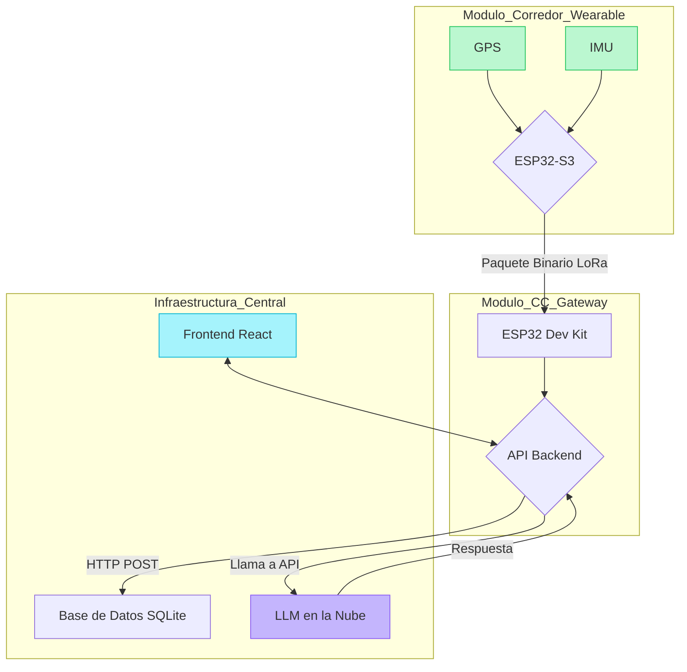

# Arquitectura del Sistema RASTRO

## Vista General

RASTRO está diseñado como un sistema distribuido de tres capas principales: los **Módulos Corredor** (nodos en el borde), el **Módulo de Centro de Control (CC)** (el gateway), y la **Interfaz de Usuario** (el dashboard web). La comunicación se realiza de forma inalámbrica a través de LoRa y se procesa en un backend central que se comunica con un LLM en la nube.

### Diagrama de Flujo de Datos

## Capas del Sistema

### 1. Capa de Percepción (Sensores)
* **GPS (L76K):** Ubicado en el Módulo Corredor, captura coordenadas (latitud, longitud), velocidad, altitud y número de satélites.
* **IMU (QMI8658):** Integrado en el Módulo Corredor, mide la aceleración en 3 ejes para la detección de caídas y el análisis de movimiento.

### 2. Capa de Procesamiento Local (Firmware)
* **Módulo Corredor (C++):** Su firmware está optimizado para la eficiencia energética. Lee los sensores, empaqueta los datos en una `struct` binaria de 28 bytes y los transmite vía LoRa.
* **Módulo CC (C++):** Actúa como un puente de protocolos. Recibe el paquete de bytes de LoRa, lo decodifica, lo reconstruye como un objeto JSON y lo envía a través de Wi-Fi a la API del backend.

### 3. Capa de Comunicación
* **LoRa:** Se utiliza para la comunicación entre el corredor y el CC. Se eligió por su largo alcance y bajo consumo, ideal para exteriores.
    * **Decisión de Diseño:** Se transmiten los datos en formato binario (`struct`) en lugar de texto (JSON) para minimizar el tiempo en el aire, lo que reduce el consumo de batería y la probabilidad de colisiones de paquetes.
* **Wi-Fi / HTTP:** El Módulo CC utiliza Wi-Fi para enviar los datos ya procesados en formato JSON a un endpoint RESTful del backend.

### 4. Capa de Lógica y Visualización
* **Backend (Python/FastAPI):** Recibe los datos, los almacena en una base de datos SQLite y expone varios endpoints para que el frontend los consuma. Orquesta las llamadas al LLM para obtener análisis predictivos.
* **Frontend (React/TypeScript):** Es una Single Page Application (SPA) que consume los datos del backend. Utiliza `axios` para hacer polling a los endpoints y `react-leaflet` para visualizar las posiciones y rutas en un mapa interactivo.

## Posibles Mejoras Futuras
* **A-GPS:** Implementar un sistema de GPS Asistido donde los módulos descarguen datos de efemérides de los satélites vía Wi-Fi antes de la carrera para un posicionamiento inicial casi instantáneo.
* **Fusión de Sensores:** Implementar un Filtro de Kalman en el backend que combine los datos del GPS y del IMU para suavizar la trayectoria del corredor y estimar la posición si la señal GPS se pierde temporalmente.
* **WebSockets:** Reemplazar el polling HTTP con una comunicación por WebSockets para una actualización de datos más eficiente y en tiempo real.