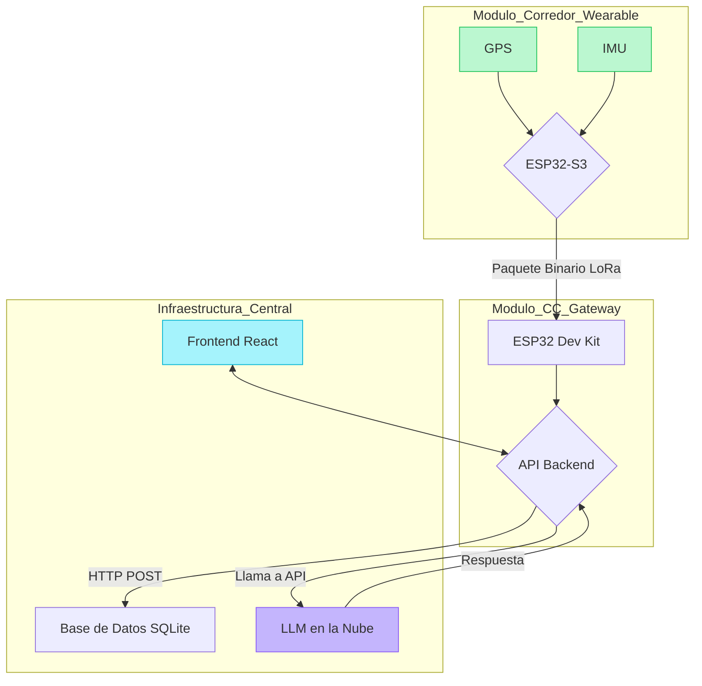

# RASTRO: Sistema de Monitoreo Deportivo en Tiempo Real 🛰️

**RASTRO** es un sistema ciberfísico de alto rendimiento diseñado para el seguimiento en vivo de atletas en competencias deportivas como ciclismo, maratones y rallies. Utilizando una combinación de hardware IoT personalizado, comunicación LoRa de largo alcance y análisis predictivo con Modelos de Lenguaje Grandes (LLM), el sistema ofrece una solución robusta y de bajo costo para la gestión y seguridad de eventos.

## 🎯 Objetivo del Sistema

El objetivo principal de RASTRO es democratizar el acceso a tecnología de seguimiento profesional, permitiendo a organizadores de eventos locales mejorar drásticamente la seguridad de los competidores y la experiencia de los espectadores. El sistema detecta caídas, predice tiempos de llegada y visualiza toda la acción en un dashboard web moderno e interactivo.

## ✨ Características Principales

* **Seguimiento GPS en Tiempo Real:** Visualización de la posición de cada corredor en un mapa interactivo.
* **Comunicación LoRa de Largo Alcance:** Cobertura fiable en terrenos donde la señal celular es inexistente.
* **Detección de Accidentes en el Borde:** El módulo del corredor utiliza un IMU para detectar impactos y enviar alertas de alta prioridad de forma autónoma.
* **Análisis Predictivo con IA:** Integración con un LLM para generar comentarios de carrera, predicciones y análisis de rendimiento en tiempo real.
* **Interfaz Moderna:** Un dashboard web responsivo construido con React y TypeScript para el monitoreo y la gestión de la carrera.
* **Autonomía Energética:** Módulos de hardware diseñados para operar durante horas con baterías LiPo.

## 🛠️ Stack Tecnológico

| Capa | Tecnología | Propósito |
| :--- | :--- | :--- |
| **Módulo Corredor** | ESP32-S3 (LILYGO T-Beam Supreme) | Microcontrolador principal |
| | C++ (Framework Arduino) | Lenguaje del Firmware |
| | TinyGPS++, RadioLib, XPowersLib, U8g2 | Librerías para GPS, LoRa, PMU y Pantalla |
| **Módulo CC** | ESP32 (Dev Kit) + Módulo LoRa | Gateway de Radio y Wi-Fi |
| | C++ (Framework Arduino) | Lenguaje del Firmware |
| | RadioLib, ArduinoJson | Librerías para LoRa y manejo de JSON |
| **Backend** | Python 3.11+ | Lenguaje del Servidor |
| | FastAPI, Uvicorn | Framework para la API RESTful |
| | SQLite | Base de datos ligera |
| **Frontend** | React + TypeScript + Vite | Framework de la Interfaz de Usuario |
| | Leaflet, React-Leaflet | Librería para el Mapa Interactivo |
| | TailwindCSS | Estilizado de la Interfaz |
| | Axios | Cliente HTTP para consumir la API |
